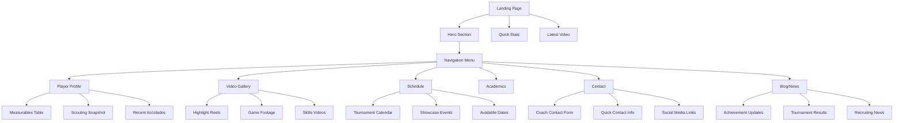

# Lana Nolan Recruiting Website - Technical Architecture Plan

## Project Overview
A modern, responsive single-page application built with Next.js and TypeScript, designed to showcase Lana Nolan's softball recruiting profile to college coaches and recruiters.

## Target Audience & Goals
- **Primary:** College coaches and recruiters seeking comprehensive player information
- **Secondary:** Family, friends, and recruiting progress tracking
- **Features:** Professional presentation, easy contact methods, recruiting progress tracking, and blog/news updates

## Technical Stack

### Frontend Framework
- **Next.js 14+** with App Router
- **TypeScript** for type safety
- **React 18+** with modern hooks and patterns
- **Tailwind CSS** for responsive styling
- **Framer Motion** for smooth animations

### Key Libraries & Tools
- **React Hook Form** for contact forms
- **React Player** for video highlights
- **React Calendar** for schedule display
- **jsPDF** for recruiting packet generation
- **Next SEO** for search optimization
- **Vercel Analytics** for performance tracking

### Deployment & Hosting
- **Vercel** for hosting and CI/CD
- **GitHub** for version control
- **Cloudinary** for media optimization
- **EmailJS** for contact form handling

## Site Architecture



## Component Structure

### Core Layout Components
1. **Header** - Navigation, logo, contact CTA
2. **Footer** - Social links, copyright, quick contact
3. **Navigation** - Smooth scroll menu with mobile hamburger
4. **Layout** - Consistent page wrapper with SEO

### Feature Components
1. **Hero Section**
   - Professional headshot
   - Key stats overlay
   - Call-to-action buttons
   - Social proof elements

2. **Video Gallery**
   - Embedded video player
   - Categorized highlight reels
   - Thumbnail navigation
   - Full-screen viewing option

3. **Interactive Calendar**
   - Tournament and showcase schedule
   - Filterable by event type
   - Coach availability indicators
   - Export to calendar functionality

4. **Contact Forms**
   - Coach inquiry form
   - General contact form
   - Form validation and submission
   - Automated email responses

5. **Recruiting Packet Generator**
   - PDF creation with player stats
   - Downloadable media kit
   - Contact information included
   - Professional formatting

## Data Management

### Content Structure
```typescript
interface PlayerProfile {
  personalInfo: {
    name: string;
    graduationYear: number;
    email: string;
    phone?: string;
    socialMedia: SocialLinks;
  };
  athletics: {
    primaryPosition: string;
    secondaryPositions: string[];
    battingThrows: 'R' | 'L' | 'S';
    height?: string;
    weight?: string;
    measurables: Measurable[];
  };
  academics: {
    gpa?: number;
    satScore?: number;
    actScore?: number;
    honors: string[];
  };
  schedule: Event[];
  videos: VideoClip[];
  accolades: Achievement[];
}
```

### Content Management
- JSON-based content files for easy updates
- TypeScript interfaces for type safety
- Automated content validation
- Version control for content changes

## User Experience Design

### Mobile-First Approach
- Responsive breakpoints: 320px, 768px, 1024px, 1440px
- Touch-friendly navigation and interactions
- Optimized media loading for mobile networks
- Progressive Web App capabilities

### Performance Optimization
- Next.js Image optimization
- Lazy loading for videos and images
- Code splitting and dynamic imports
- CDN delivery for static assets
- Core Web Vitals optimization

### Accessibility Features
- WCAG 2.1 AA compliance
- Keyboard navigation support
- Screen reader optimization
- High contrast mode support
- Alt text for all media

## SEO Strategy

### Technical SEO
- Structured data markup for athlete profiles
- Open Graph tags for social sharing
- XML sitemap generation
- Robot.txt optimization
- Page speed optimization

### Content SEO
- Targeted keywords for softball recruiting
- Meta descriptions for each section
- Schema markup for sports profiles
- Local SEO for geographic targeting

## Security & Privacy

### Data Protection
- GDPR compliance for international coaches
- Secure contact form handling
- No sensitive data storage
- Privacy policy implementation

### Performance Monitoring
- Core Web Vitals tracking
- User interaction analytics
- Error monitoring and reporting
- A/B testing capabilities

## Development Phases

### Phase 1: Foundation (Week 1-2)
- Project setup and configuration
- Core layout components
- Basic responsive design
- Content structure definition

### Phase 2: Core Features (Week 3-4)
- Player profile sections
- Video gallery implementation
- Contact forms development
- Calendar integration

### Phase 3: Advanced Features (Week 5-6)
- PDF generation system
- Blog/news functionality
- SEO optimization
- Performance tuning

### Phase 4: Testing & Launch (Week 7-8)
- Cross-browser testing
- Mobile device testing
- Content population
- Deployment and monitoring

## Success Metrics

### Primary KPIs
- Coach contact form submissions
- Video engagement rates
- Recruiting packet downloads
- Site visit duration

### Secondary Metrics
- Mobile vs desktop usage
- Geographic visitor distribution
- Social media click-through rates
- Page load performance scores

## Future Enhancements

### Potential Additions
- Recruiting timeline tracker
- Coach communication log
- Statistics visualization charts
- Email newsletter system
- Multi-language support
- Advanced analytics dashboard

This architecture provides a solid foundation for a professional recruiting website that will effectively showcase Lana's talents to college coaches while maintaining excellent user experience and performance.